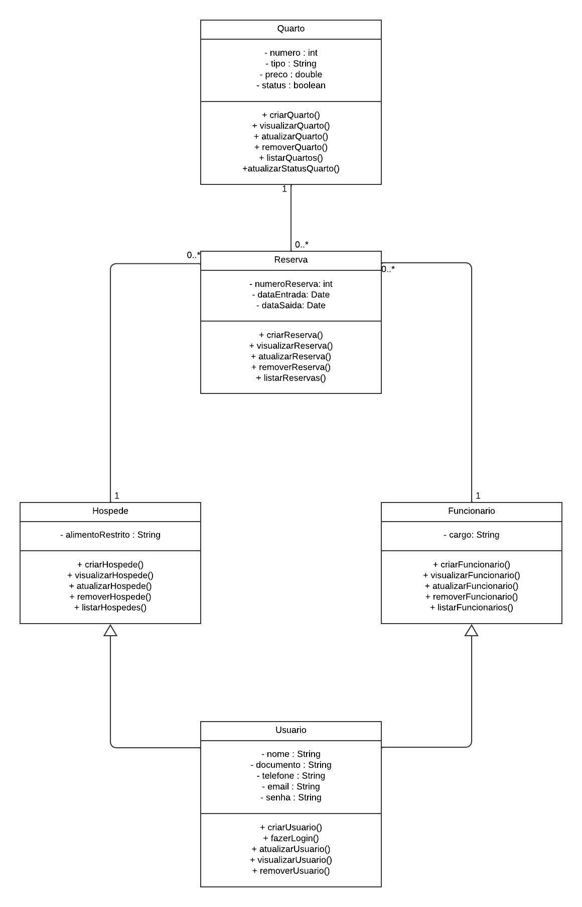

# Gerenciamento de Pousada

## Tópicos

- [Descrição](#descrição)
- [Funcionalidades](#funcionalidades)
- [Diagrama de Classes](#diagrama-de-classes)
- [Requisitos](#requisitos)
- [Instalações](#instalações)
- [Equipe de Desenvolvimento](#equipe-de-desenvolvimento)
- [Licença](#licença)

## Descrição

O projeto tem como objetivo criar um sistema de gerenciamento para uma pousada, permitindo a administração de quartos, reservas, hóspedes e funcionários de forma eficiente. 

## Funcionalidades

- **Login para funcionários e hóspedes:** Sistema de login com verificação de dados e menus personalizados para diferentes tipos de usuários.
- **Cadastro, remoção e atualização de dados:** Funcionalidade para gerenciar funcionários, hóspedes, quartos e reservas.
- **Gerenciamento de reservas:** Possibilidade de cadastrar, atualizar ou remover uma reserva, com atualização automática do status dos quartos.

## Diagrama de Classes



O diagrama de classes do projeto mostra as principais entidades e suas interações, como `Funcionario`, `Hospede`, `Quarto` e `Reserva`.

## Requisitos

- **Linguagem:** O presente projeto foi desenvolvido com o Java. Acesse [Oracle](https://www.oracle.com/br/java/) para mais informações.
- **Banco de Dados:** [PostgreSQL](https://www.postgresql.org/download/) (configuração manual, sem dependências de ORM).

## Instalações

1. **Clone o repositório:**
   ```bash
   git clone https://github.com/johanpq/Hostel-Management.git
2. **Configuração de conexão com o Banco de Dados:** Localize os seguintes arquivos na pasta `db`:
   - `ConnectionFactory.java`
   - `TestConnection.java` 
3. **Criar a pasta `config`:**
   - No diretório `src`, crie a pasta `config` e coloque o arquivo `ConnectionFactory.java` nela.
   - Crie o banco de dados e as tabelas com o script SQL em `db/setup.sql`.
   - No arquivo `ConnectionFactory.java`, configure a `URL`, `User`, e `Password` do seu Banco de Dados.
4. **Criar a pasta `test`:**
    - Dentro de `src`, crie a pasta `test` e mova o arquivo `TestConnection.java` para essa pasta.

5. **Criar a pasta `lib`:**
   - Baixe o arquivo `.jar` do PostgreSQL e coloque dentro de `lib` que estará dentro de `src`.

6. **Criar a pasta `bin`:**

- Navegue até o diretório `src`:

   Para Windows:

      java -cp "lib/postgresql-42.7.4.jar;bin" test.TestConnection

   Para Linux:

      javac -d ../bin -cp "src/lib/" src//.java
    
6. **Estabelecer a conexão com o Banco de Dados:**
  
- Navegue até o diretório `src`:

       cd src

7. **Executar o arquivo de teste de conexão:**

   Para Windows:

       javac -d bin -cp "lib/postgresql-42.7.4.jar;bin" test/TestConnection.java

    Para Linux:

       java -cp "lib/postgresql-42.7.4.jar:../bin" test.TestConnection
  
8. **Executar o sistema principal:** Entre dentro de `src` e execute:
   
   Para Windows:
   
       ./run.bat
   Para Linux:
                                                                                                                        
       ./run.sh

## Equipe de Desenvolvimento

- Johan Queiroz
- Luiz Rodrigo
- Servolo Pedro

## Licença

Este projeto é licenciado sob a [Licença MIT](LICENSE.md).

